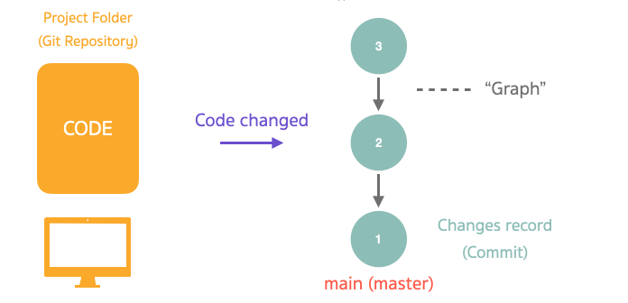

# Git ทำงานยังไง ? 🚀

เวลาเราทำงานเราจะมี Project Folder ของเราอยู่ ให้เราทำการบอกให้ Git มา track การเปลี่ยนแปลงของ Project Folder นี้ เมื่อ Git มา track เรียบร้อยแล้วเราจะเรียก Folder นี้ว่า Repository (หรือสั้น ๆ ว่า **"Repo"**)

เมื่อ Code มีการเปลี่ยนแปลง Git จะเห็นการเปลี่ยนแปลงนั้น ๆ แล้ว Git ทำให้เราสามารถที่จะเลือก Save การเปลี่ยนแปลง ๆ นั้น ๆ ไว้เป็น Record ได้เป็นจุด ๆ ไป **เราเรียกการ Save นี้ว่า "Commit"** จากรูปเรามี Commit ทั้งหมด 3 Commits

การเปลี่ยนแปลงแต่ละก้อนนั้นจะมีเส้นเชื่อมโยงกัน ตัวใหม่จะโยงไปหาตัวก่อนหน้าเสมอ ๆ ซึ่งทำให้เราสามารถที่จะรู้ได้ว่า Code ของเราเปลี่ยนแปลงอย่างไร และทำให้เราสามารถที่จะย้อน Code กลับไปหาจุดก่อนหน้าได้ด้วย การเชื่อมโยงแบบนี้จะมีโครงสร้างเป็น "Graph"

 
 

## Getting Started

1. ให้เราสร้าง Project Folder ขึ้นมาชื่อ `learn-git` และ ทำการเข้าไปที่ Folder ด้วย `cd learn-git`

2. เราจะทำการบอกให้ Git มา Track Project Folder ของเราด้วยคำสั่ง `git init`

3. ให้เราสร้างไฟล์ index.html ขึ้นมาจากนั้นลองสร้าง tag ง่าย ๆ ว่า `<h1>Hello CODECAM #8</h1>`

4. จากนั้นให้เรากลับไปที่ CMD หรือ Terminal แล้วพิมพ์ `git status` มันจะบอก status ของ Folder เราว่ามีอะไรเปลี่ยนแปลงไปบ้าง

5. ต่อไปเราจะทำการเลือกไฟล์ที่จะเตรียมตัว Save การเปลี่ยนแปลงนี้เก็บไว้เป็น Record ด้วย `git add <file_name>` ในที่นี้เราจะเอาไฟล์ index.html เราก็จะพิมพ์ไปว่า `git add index.html` จากนั้นให้ลองพิมพ์ `git status` ดูเราจะเห็นว่าไฟล์ที่มันเปลี่ยนแปลงไปนั้นเป็นสีเขียว ซึ่งพร้อมที่จะถูกนำไป Save เก็บไว้เป็น Record ที่เรียกว่า **"Commit"**

6. จากนั้นให้เราพิมพ์ `git commit -m "add heading text"` เพื่อเป็นการ Commit การเปลี่ยนแปลง พร้อมกับใส่ Commit message ว่า Commit นี้หมายความว่ายังไง

7. จากนั้นเราจะทำการดู records ที่เรา save ลงไป ด้วย `git log --graph --decorate --oneline --all` เราจะสังเกตเห็นว่ามันมี \* ซึ่งก็คือ Commit ของเรานั้นเอง แล้วมันก็จะมี commit message อธิบาย

8. ให้สังเกตว่ามันจะมี เลขอะไรสักอย่างกำกับ เช่น `068554a` เลขตัวนี้เป็น id ของ commit ที่จะสามารถระบุ commit นั้น ๆ ได้

9. ให้เราทำการแก้ไขไฟล์ด้วยการเพิ่ม `<h2>Some more code :)</h2>` เข้าไป จากนั้นก็ให้ทำการ commit

   - `git add index.html`
   - `git commit -m "add some code"`

10. จากนั้นให้เราลอง `git log --graph --decorate --oneline --all` เพื่อดู Record ของการเปลี่ยนแปลง

11. ให้เรา save เลข commit ไว้ จากนั้นให้เราทำการพิมพ์ `git checkout <commit_id>` เพื่อทำการเลือก record ของการเปลี่ยนแปลงที่เราอยากจะให้มันแสดงผล จากนั้นให้เราสังเกตไฟล์ `index.html` มันจะเป็น code version ก่อนหน้าที่เราจะ commit h2 เข้าไป

12. ให้เราลอง `git log --graph --decorate --oneline --all` แล้วสังเกต HEAD มันจะเป็นตัวชี้ว่าเราอยู่ที่ code จุดไหน

13. ให้เรากลับไปยัง code version เดิม `git checkout master`

[ไปเนื้อหาต่อไป](https://github.com/napatwongchr/intro-to-git/blob/main/lessons/3-git-branches-and-merging.md)

[ย้อนกลับไป](https://github.com/napatwongchr/intro-to-git/blob/main/lessons/1-what-is-git-and-why.md)
