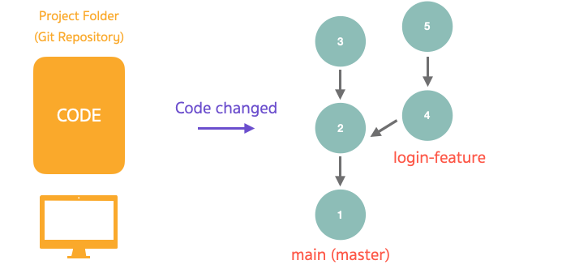
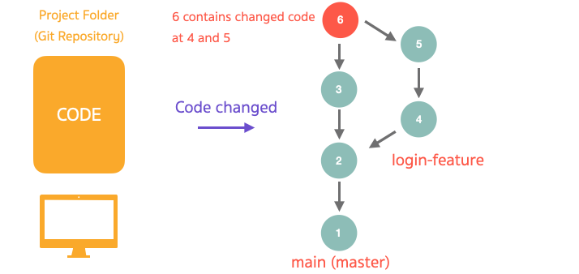

# Git Branches And Merging

## Git Branches

Git สามารถที่จะทำการแตก Branch ออกมาจาก Branch เดิมได้ เพื่อที่ทำให้เราพัฒนา software ในทีมได้ง่ายมากยิ่งขึ้น และเพิ่มความคล่องตัวในการทำงานของตัวเราเอง

ยกตัวอย่างเช่น เรามี requirement เกี่ยวกับ feature login ที่ต้องทำ เราก็แตก branch ออกมาจาก branch หลักเพื่อทำ feature นี้ สมมติว่ามีสถานการที่ต้องรีบเอา feature อื่น ๆ ขึ้นไปให้ users ใช้งานก่อนเราก็แค่สลับไป branch อื่นที่เราสร้างไว้ แล้วค่อยกลับมาทำให้เสร็จ



<br><hr><br>

## Creating Branch

มีอยู่วันนึงลูกค้าอยากได้ login feature

1. ให้เราทำการ Create branch ขึ้นมาใหม่เพื่อความคล่องตัวในการทำงานด้วย `git checkout -b "login-feature"`

2. ตอนนี้เราอยู่ที่ Branch login-feature เรียบร้อยแล้ว เรามาทำความรู้จักกับคำสั่งเกี่ยวกับ Branch นิดหน่อยดีกว่า

   - `git branch` เป็นการ List branch ทั้งหมดที่อยู่บนเครื่องเรา
   - `git branch -M <new_branch_name>` เป็นการเปลี่ยนชื่อ Branch ที่เราทำงานอยู่
   - `git branch -d <branch_name>` เป็นการลบ Branch

3. ให้เราทำการ dev login feature เข้าไปที่ index.html ด้วย `<h1>This is super useful login feature</h1>`

4. เมื่อเรา dev พอใจแล้วให้เราทำการ commit การเปลี่ยนแปลงนั้น ๆ

   - `git status` เช็คการเปลี่ยนแปลงของไฟล์ใน repo
   - `git add .` ในที่นี้เราจะใช้ . เพราะว่าเราจะเลือกทุกไฟล์
   - `git commit -m "add login feature"`

5. จากนั้นเราจะทำการดู Saved Records ของเราด้วย `git log --graph --decorate --oneline --all`

<br><hr><br>

## Git Merging



เมื่อเราทำ feature เสร็จเรียบร้อยแล้ว เราต้องการที่จะรวม code กลับเข้าไปที่ branch หลัก ให้เราทำการ merge

การ merge นั้นสามารถทำให้เกิด **"Merge conflicts"** กันเนื่องจากเราอาจจะบังเอิญไปแก้โค้ดบางส่วนของไฟล์เดียวกันกับของเพื่อนในทีม Git จะมองเห็น Merge conflicts ตรงนี้แล้วให้เราเป็นคนแก้ไขโค้ดส่วนที่ conflicts กันว่าเราจะเอาโค้ดส่วนไหนของใคร

<br><hr><br>

## Let's Merge It ! ✌️

ทีม Developer ได้ทำ login feature เสร็จเรียบร้อยแล้ว สิ่งที่เราต้องทำคือ Merge code เข้าไปที่ branch หลัก

1. ให้ทำการ checkout ไปที่ branch master ด้วย `git checkout master`

2. จากนั้น เราจะทำการ merge code จาก branch login-feature เข้ากับ master ด้วย `git merge login-feature`

3. จากนั้นเราจะทำการดู Saved Records ของเราด้วย `git log --graph --decorate --oneline --all` เราจะเห็นว่า master ของเรามันขยับขึ้นมาอยู่จุดเดียวกันกับ login-feature

## Merge Conflicts 😱

1. ให้ทำการสร้าง branch ใหม่ `git checkout -b "promotion-feature"`

2. ให้ทำการแก้ไข `index.html` ที่

```html
<h1>This is super useful login feature</h1>
```

เป็น

```html
<h1>
  This is super useful login feature with promotion at PROMOTION-FEATURE branch
</h1>
```

3. ให้ทำการ commit

4. จากนั้นในขณะเดียวกันมันมีการเปลี่ยนแปลงที่ master branch เราจะ checkout master ไปแก้ไข index.html ในบรรทัดเดียวกันกับที่เราแก้ใน `promotion-feature`

```html
<h1>This is super useful login feature</h1>
```

เป็น

```html
<h1>This is super useful login feature with promotion at MASTER branch</h1>
```

5. จากนั้นเราจะทำการดู Saved Records ของเราด้วย `git log --graph --decorate --oneline --all` เราจะเห็นว่า branch master และ promotion-feature ต่างคนต่างมีการเปลี่ยนแปลงเกิดขึ้น

6. ให้เราทำการ merge branch promotion-feature เข้่า branch master `git merge promotion-feature`

7. เราจะเห็นว่ามันเกิด merge conflict ! ให้เราทำการแก้ไขในสิ่งที่เราอยากจะให้ code มันเป็น

8. จากนั้นให้เรา commit การแก้ไขนั้นของเรา

9. จากนั้นเราจะทำการดู Saved Records ของเราด้วย `git log --graph --decorate --oneline --all` เราจะเห็นว่า promotion-feature มันเลี้ยวเข้าไปรวมกันกับ master

[ไปเนื้อหาต่อไป](https://github.com/napatwongchr/intro-to-git/blob/main/lessons/4-remote-repository.md)

[ย้อนกลับไป](https://github.com/napatwongchr/intro-to-git/blob/main/lessons/2-how-git-works.md)

[ไปหน้าหลัก](https://github.com/napatwongchr/intro-to-git/blob/main/README.md)
