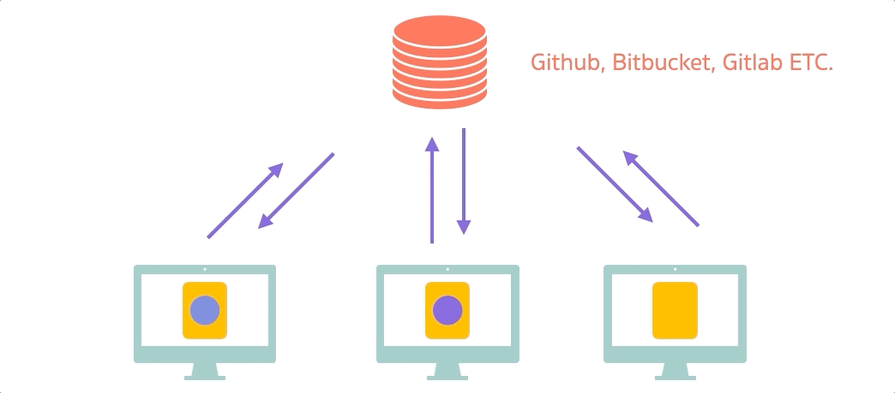

# Git Remote Repository 💻

Remote Repository คือ ที่ที่เก็บ Repository ของเราไว้บน server กลาง ซึ่งทำให้เราสามารถที่จะแชร์โค้ด และทำการเปลี่ยนแปลง download upload โค้ดจากคนอื่น ๆ ได้ ทำให้เราทำงานกับเพื่อนคนอื่นๆ ได้



จากรูปด้านบน ปกติแล้วเวลาเราทำงานเราจะมี git history records ของการเปลี่ยนแปลง ที่อยู่บนเครื่องของเราเอง เราสามารถ upload โค้ดขึ้นไปบน remote repository ได้ **การ upload โค้ดขึ้นไป เราจะเรียกว่า "Push"** และเพื่อนเราก็สามารถที่จะ download โค้ดลงมาได้ **การ download โค้ดลงมาเราจะเรียกว่า "Pull"**

ผู้ให้บริการ Git Remote Repository ก็จะมีหลายเจ้ามาก ที่ใช้บ่อย ๆ ก็จะเป็น [Github](https://github.com/), [Bitbucket](https://bitbucket.org/product), [Gitlab](https://about.gitlab.com/)

## Let's Create Repository on Github

1. สมัคร Account Github ถ้ายังไม่มี แล้วจากนั้นให้กดปุ่ม + มุมขวาบนของเว็บ แล้วทำกด `New Repository`

2. ให้เราใส่ Repository name ลงไปจากนั้นให้กด Create repository

3. จากนั้นไปที่ `learn-git` folder ของเราบนเครื่องให้ทำการ Link Repo บนเครื่องเข้ากับ Repo Github

```
git remote add origin <github_repo_name>
git branch -M main
git push -u origin main
```

4. จากนั้นเราก็จะเห็นว่าไฟล์บนเครื่องเราได้ถูก Upload ขึ้นไปบน Github repository

5. ต่อไปให้เราทำการ Create branch ใหม่ชื่อว่า `show-product-feature` แล้วทำการแก้ไขไฟล์อะไรสักอย่างไป

6. ทำการ Commit code

7. จากนั้นเราจะทำการดู Graph ด้วย `git log --graph --decorate --oneline --all` เราจะเห็นว่ามันมี branch origin ขึ้นมา ซึ่ง branch origin หมายความว่าเป็น branch ที่อยู่ข้างบน Github repo

8. แต่สิ่งที่เราแก้ยังไม่ถูก upload ขึ้นไปบน repo ให้ราทำการ upload ด้วยคำสั่ง `git push` เราจะเห็นว่่ามันให้ set upstream ก่อนให้เราทำการ set ตามคำสั่งที่มันบอกเราได้เลย

9. จากนั้นไปดูที่ `git log --graph --decorate --oneline --all` เราจะเห็นว่า branch เราขึ้นไปอยู่บน Github repo เรียบร้อย ให้สังเกตที่ origin

[ไปเนื้อหาต่อไป](https://github.com/napatwongchr/intro-to-git/blob/main/lessons/5-pull-requests.md)

[ย้อนกลับไป](https://github.com/napatwongchr/intro-to-git/blob/main/lessons/3-git-branches-and-merging.md)
