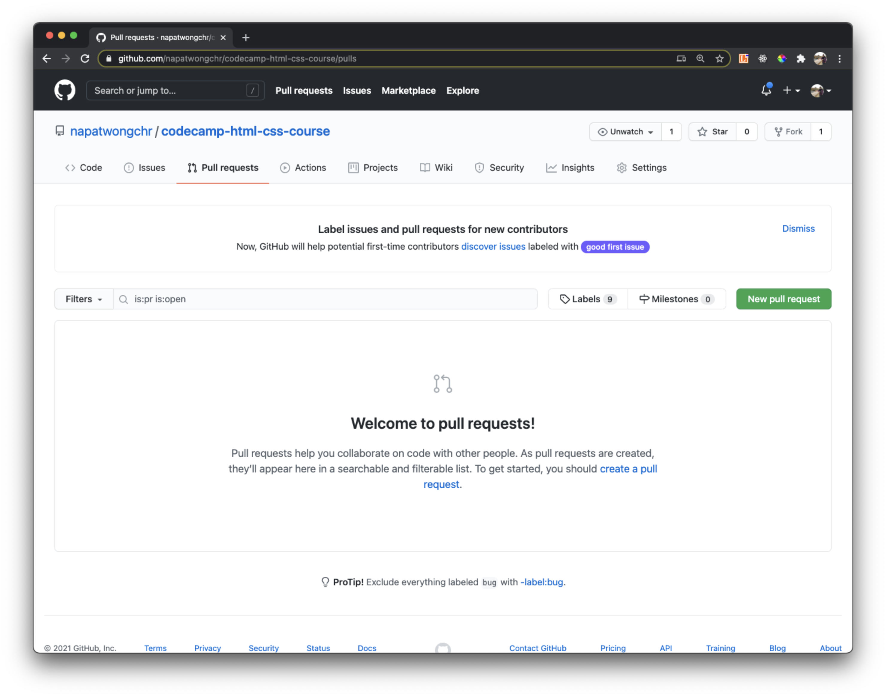

# Pull Requests

Pull Requests คือ การที่เรามาช่วยกันดูการเปลี่ยนแปลงของโค้่ด ก่อนที่เราจะ merge เข้าไปใน codebase ของเรา

ยกตัวอย่างเช่น ถ้าเราแตก branch จาก branch หลักออกมาเพื่อทำ feature อะไรสักอย่างนึง การที่เราจะ merge กลับเข้าไป branch หลัก เราสามารถที่จะสร้าง pull request เพื่อส่งให้กับคนดูแล codebase เพื่อทำ **"Code Review"** ถ้า review ผ่าน โค้ดของเราก็จะถูก merge เข้า branch หลัก

## Let's Create Your First Pull Request !

1. ให้เราทำการ Create branch ใหม่ชื่อว่า `my-feature` แล้วทำการแก้ไขไฟล์อะไรสักอย่างไป

2. ทำการ commit

3. ทำการ push

4. ไปที่ Github repo แล้วเข้าไปที่ Tab Pull Request แล้วกด **"New pull request"**

5. จากนั้นให้ทำการเลือก branch ของเราที่จะขอ merge เข้า main code ในที่นี่เราจะเอา my-feature เข้า main

**base:main** **<-** **compare:my-feature**

6. กด **"Create pull request"** จากนั้นให้เราใส่คำอธิบาย แล้วกด Create ได้เลย

7. จากนั้นเราก็จะเห็น Pull request ของเรา เพื่อนร่วมทีมสามารถเข้ามา Review Code ของเราได้ แล้วก็ comment ได้ เมื่อเพื่อนร่วมทีม OK กับ Code เรา มันจะมีปุ่ม **"Merge pull request"** เราสามารถกดได้เลย

8. จากนั้น Code เราก็จะเข้าไปรวมใน branch หลักเรียบร้อย

[ย้อนกลับไป](https://github.com/napatwongchr/intro-to-git/blob/main/lessons/4-remote-repository.md)
